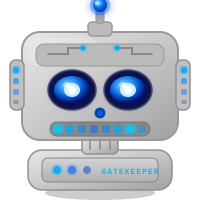

<div align="center">



# 🤖 GateKeeper

### Your Autonomous AI DevOps Engineer — Always On Call

*Every release passes through me. I block the bad ones. I clear the good ones. I tell you exactly why.*

[](https://github.com/features/actions)
[](https://anthropic.com)
[](https://deepseek.com)
[](https://nodejs.org)
[](https://tavily.com)
[](https://firecrawl.dev)

</div>

---

## ✨ What is GateKeeper?

GateKeeper is a **fully autonomous AI DevOps agent** — not a linter, not a checklist, not a chatbot that tells you what it *would* do. He's a senior DevOps engineer with real tools who reviews every release before it ships.

He fires automatically on every PR, runs 9 deterministic policy gates, calls Claude Sonnet for a qualitative risk assessment, and posts an official **Release Readiness Certificate** directly on the PR — with a commit status that can block the merge if the release isn't ready.

But he's more than a CI bot. Run him as a **local chat agent** and he'll:

- 🔍 Read, write, and search your files
- 💻 Run terminal commands and report back
- 🌐 Search the web and scrape docs in real time
- 🐙 Manage GitHub issues, PRs, and workflows
- 🎫 Create and update Jira tickets
- 📣 Send Slack notifications
- 🧠 Remember everything about you and your projects — across all sessions
- 💬 Talk to you like a brilliant friend, not a corporate bot

---

## 🔄 How It Works (CI Mode)

```
PR Opened / Updated
        │
        ▼
┌───────────────────────────────────────────────────────────┐
│                      🤖 GateKeeper                        │
│                                                           │
│  1️⃣  Read flags.json from the PR branch                   │
│  2️⃣  Validate schema              →  DeepSeek             │
│  3️⃣  Run 9 deterministic gates    →  Policy engine        │
│  4️⃣  Pre-process gate context     →  DeepSeek             │
│  5️⃣  Full qualitative assessment  →  Claude Sonnet        │
│  6️⃣  Generate Release Certificate →  certificate.js       │
│  7️⃣  Post PR comment + set status →  GitHub API           │
└───────────────────────────────────────────────────────────┘
        │
        ▼
  📋 PR Comment: Release Readiness Certificate
  🚦 Commit Status: ✅ CLEARED · ⚠️ WITH-CAUTION · ❌ BLOCKED
```

---

## 🛡️ The 9 Policy Gates

| # | Gate | Weight | What It Checks |
|---|------|--------|----------------|
| 1 | 🔓 Kill Switch | **BLOCKER** | Emergency override — stops all releases instantly |
| 2 | 📊 Rollout % | 10 pts | Safe rollout bounds, canary cross-check |
| 3 | 🌍 Environment | 22 pts | Staging must be validated before production |
| 4 | 🧪 Test Coverage | 20 pts | Meets your minimum coverage threshold |
| 5 | 📉 Error Rate | 18 pts | Production error rate within SLO bounds |
| 6 | 🐤 Canary Health | 10 pts | Canary deployment health and score |
| 7 | ⏳ Flag Age | 8 pts | Feature flags can't exceed 90 days stale |
| 8 | 💥 Blast Radius | 6 pts | User impact + rollback plan validation |
| 9 | 🔒 Dependencies | 6 pts | No critical CVEs, fresh npm audit |

**Score = weighted sum of gates 2–9 (0–100)**

| Score | Status | Exit Code |
|-------|--------|-----------|
| Kill switch active | 🔴 **BLOCKED** | `1` |
| < 50 | 🔴 **BLOCKED** | `1` |
| 50–79 or any FAILED | 🟡 **WITH-CAUTION** | `0` (or `1` in strict mode) |
| ≥ 80, no failures | 🟢 **CLEARED** | `0` |

---

## 📜 The Release Certificate

Every PR gets a certificate posted automatically:

```
╔══════════════════════════════════════════════════════════════════════╗
║  🤖  G A T E K E E P E R   R E L E A S E   C E R T I F I C A T E  ║
╠══════════════════════════════════════════════════════════════════════╣
║  Feature:  payment-v2              Version: 2.1.0                   ║
║  Owner:    payments-team           PR:      #42                     ║
║  Branch:   feat/payment-v2                                          ║
║  Assessed: 2024-03-15T12:00:00.000Z                                 ║
╠══════════════════════════════════════════════════════════════════════╣
║  Score: ████████████████░░░░  82/100                                ║
║  Status: CLEARED         AI Risk: LOW                               ║
╚══════════════════════════════════════════════════════════════════════╝
```

Includes: status banner · blockers table · warnings · Claude's full risk assessment · exact remediation steps · full gate summary · signed timestamp

---

## 💬 Chat Mode — GateKeeper as Your Personal DevOps Engineer

GateKeeper isn't just a CI bot. Run him locally and talk to him like a real engineer.

```bash
npm start
# → Open http://localhost:3000
```

He has **real tools** and actually uses them:

| Tool | What He Does |
|------|-------------|
| 📁 `read_file` / `write_file` | Read and edit any file in your project |
| 💻 `run_terminal_command` | Execute shell commands, show real output |
| 🔍 `search_files` | Grep across your codebase |
| 🌐 `web_search` | Live web search via Tavily |
| 🔥 `firecrawl_search` | Deep page scraping and doc extraction |
| 🐙 GitHub tools | Create issues, check PRs, list workflows |
| 🎫 Jira tools | Create, search, and update tickets |
| 📣 Slack tools | Send messages to channels |
| 🧠 Memory tools | Remember and recall across all sessions |
| 🚦 `run_release_gate` | Full 9-gate policy check on any flags.json |

He narrates what he's doing as he works — no silent spinning, no black box.

---

## 🚀 Setup

### 1. Clone & install

```bash
git clone https://github.com/DaCameraGirl/gatekeeper.git
cd gatekeeper
npm install
```

### 2. Configure your environment

```bash
cp .env.example .env
# Fill in your API keys — see table below
```

> ⚠️ **Never commit your `.env` file.** It's already in `.gitignore` — keep it that way. Your API keys are private and should never be pushed to GitHub.

### 3. Run the chat agent

```bash
npm start
# → http://localhost:3000
```

### 4. (CI mode) Add GitHub secrets

Go to **Settings → Secrets and variables → Actions** and add:

| Secret | Description |
|--------|-------------|
| `ANTHROPIC_API_KEY` | Claude API key — required |
| `DEEPSEEK_API_KEY` | DeepSeek API key — required |

`GITHUB_TOKEN` is provided automatically by GitHub Actions.

### 5. (CI mode) Protect your branch

In **Settings → Branches → Branch protection rules**, add:

```
🤖 GateKeeper / Release Gate
```

as a required status check to block merges on `BLOCKED` releases.

---

## 🔑 Environment Variables

| Variable | Description |
|----------|-------------|
| `ANTHROPIC_API_KEY` | Claude API key (**required**) |
| `DEEPSEEK_API_KEY` | DeepSeek API key (required for schema validation) |
| `GITHUB_TOKEN` | GitHub token (auto in Actions, set in .env for local) |
| `TAVILY_API_KEY` | Web search — get free key at [tavily.com](https://tavily.com) |
| `FIRECRAWL_API_KEY` | Deep web scraping — [firecrawl.dev](https://firecrawl.dev) |
| `SLACK_BOT_TOKEN` | Slack bot token for notifications |
| `GITHUB_REPOSITORY` | `owner/repo` format |
| `FLAGS_JSON_PATH` | Path to flags.json (default: `./flags.json`) |
| `GATEKEEPER_STRICT` | `true` = WITH-CAUTION also exits 1 |
| `GATEKEEPER_DRY_RUN` | `true` = skip GitHub API, print to console |

---

## 🗂️ Architecture

```
GateKeeper/
├── server.js                   — Chat server + streaming agent loop
├── public/
│   └── index.html              — Chat UI
├── src/
│   ├── index.js                — CI orchestrator (9-step pipeline)
│   ├── utils.js                — Scoring + formatting utilities
│   ├── certificate.js          — Release certificate generator
│   ├── github.js               — GitHub API (comments, commit status)
│   ├── brain/
│   │   ├── claude.js           — Claude Sonnet risk assessment
│   │   └── deepseek.js         — DeepSeek schema validation + context prep
│   ├── tools/
│   │   ├── definitions.js      — All tool schemas (Claude tool_use API)
│   │   └── executor.js         — Tool implementations (real actions)
│   ├── memory/
│   │   └── store.js            — Persistent memory across sessions
│   └── gates/
│       ├── index.js            — Gate runner + score calculator
│       ├── gate1-kill-switch.js
│       ├── gate2-rollout.js
│       ├── gate3-environment.js
│       ├── gate4-test-coverage.js
│       ├── gate5-error-rate.js
│       ├── gate6-canary.js
│       ├── gate7-flag-age.js
│       ├── gate8-blast-radius.js
│       └── gate9-dependencies.js
└── .env.example                — Copy this → .env and fill in your keys
```

---

## 🏗️ flags.json Reference

| Field | Type | Required | Description |
|-------|------|----------|-------------|
| `release.feature` | string | ✅ | Feature name (slug) |
| `release.version` | string | ✅ | Semver version |
| `release.owner` | string | ✅ | Team or individual owner |
| `flags.killSwitch` | boolean | ✅ | Emergency blocker switch |
| `flags.rolloutPercentage` | number | ✅ | Current rollout % (0–100) |
| `flags.environments.*` | object | recommended | Per-environment validation records |
| `quality.testCoverage` | number | recommended | Test coverage % |
| `quality.errorRatePercent` | number | recommended | Current error rate % |
| `risk.blastRadius` | string | recommended | `low` / `medium` / `high` / `critical` |
| `risk.hasRollbackPlan` | boolean | recommended | Whether a rollback plan exists |
| `dependencies.criticalVulnerabilities` | number | recommended | Count of CRITICAL CVEs |

---

<div align="center">

🤖 **GateKeeper** · Autonomous Release Intelligence

*Built by [Angela Hudson](https://github.com/DaCameraGirl) · Powered by Claude AI · Deployed via GitHub Actions*

</div>
